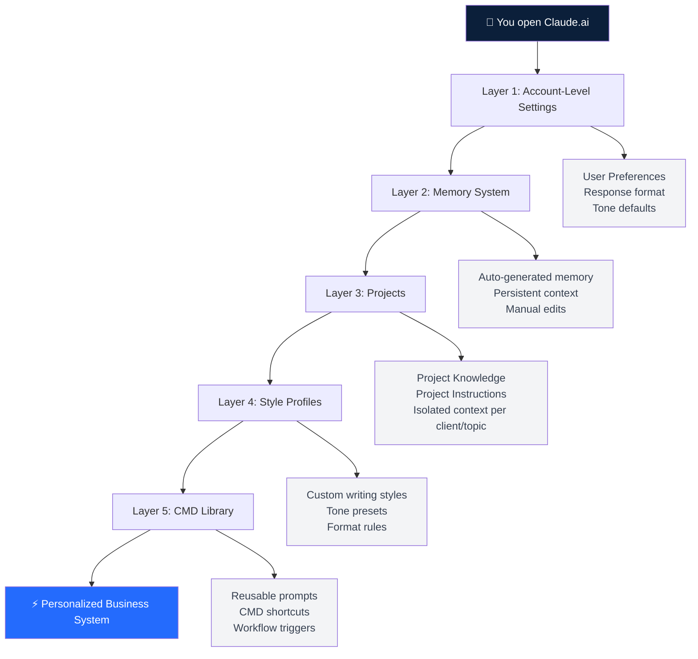
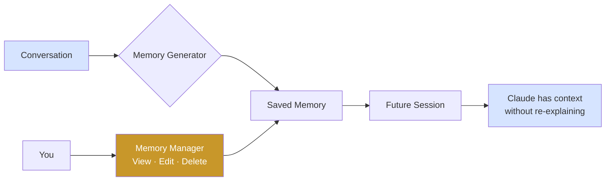
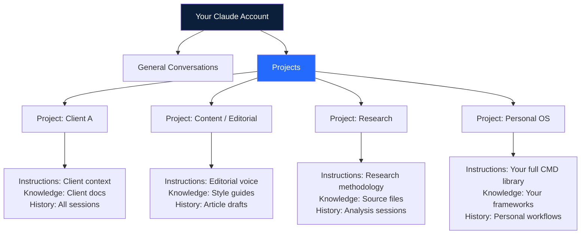
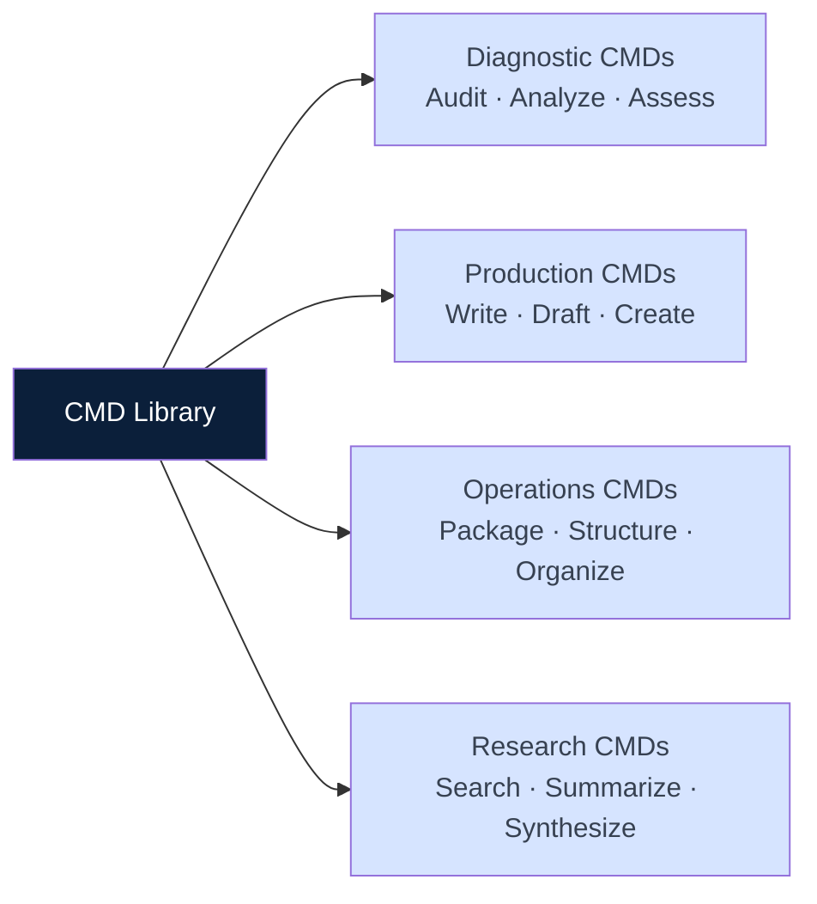

# Master CMD: Personalize Your Claude.ai Account
## A System Setup Guide for Knowledge Workers
**Review Journal · Leonardo Batista · 2026-05-14**
**Version: 1.0 · Verified against: support.claude.com · EU AI Act Article 4 compliant**

---

> **Before you start:** This guide covers verified Claude.ai features as of May 2026.
> Features update regularly. Always confirm current availability at → https://support.claude.com

---

## THE CORE IDEA

Most people use Claude as a chatbox.
They open it, type a question, get an answer, close it.

That is the lowest return possible from the tool.

Your Claude.ai account has five configuration layers.
Each layer compounds the one before it.
Configured correctly, Claude operates as a personalized business system — not a generic assistant.

**The Anthropic AI Fluency Index (9,830 conversations) found this:** users who engage iteratively with structured context have 2.67× more fluency behaviors and are 5.6× more likely to question Claude's reasoning — the single most important quality signal.

Setup is where that fluency starts.

---

## THE SETUP ARCHITECTURE



---

## LAYER 1 — ACCOUNT-LEVEL SETTINGS

**What it is.** Global preferences that apply to every Claude conversation unless overridden at the Project level.

**Where to find it.** claude.ai → Settings → User Preferences

**What to configure:**

```
[USER PREFERENCES — COPY AND ADAPT]

Communication style:
- Be direct. No preamble. No "Great question!" openings.
- Short sentences. Maximum 20 words per sentence.
- If I ask for a list, give me a list. If I ask for prose, give me prose.
- Never pad responses with summaries I didn't request.

Response format defaults:
- Use headers only when content has 3+ distinct sections.
- Use bullet points only for genuinely enumerable items.
- Default to prose for analysis, opinion, and explanation.
- Use Mermaid diagrams for any system, flow, or architecture.

Epistemic rules:
- Separate fact from inference. Label uncertain claims.
- Never present a hypothesis as a conclusion.
- If you don't know, say so. Don't fill with plausible-sounding text.

My context:
- I am a [role: consultant / analyst / founder / operator].
- My work involves [primary domain].
- My primary output formats are [articles / reports / client deliverables / code].
- My audience is [description: non-technical executives / technical operators / etc.].
```

**Why this matters.** Every response Claude produces without these instructions is optimized for a generic user. That is not you. Setting these once eliminates the need to re-explain your preferences in every session.

---

## LAYER 2 — MEMORY SYSTEM

**What it is.** Claude can generate and store memories from your conversations. These appear in future sessions automatically — without you re-explaining your background, role, or preferences.

**Where to find it.** claude.ai → Settings → Memory (toggle on/off)

**How it works.**



**What to do:**

```
MEMORY SETUP CMD

Step 1: Enable memory in Settings → Memory

Step 2: Start a new conversation and paste this:

"I want to configure my memory profile.
Please generate and save the following as memories:

- My name: [name]
- My role: [role]
- My primary use cases for Claude: [list]
- My preferred output format: [description]
- Topics I work on regularly: [list]
- Context I always need you to have: [description]"

Step 3: Review what Claude saves. Edit or delete anything inaccurate.
Settings → Memory → View all memories

Step 4: Test it. Open a new conversation.
Ask: "What do you know about me?" — Claude should surface your profile.
```

**What not to store in memory.** Do not store sensitive information — client names, financial data, credentials, or anything you would not want persisted across sessions. Memory is not encrypted per-session. Treat it as a professional profile, not a private vault.

---

## LAYER 3 — PROJECTS

**What it is.** Projects are isolated workspaces. Each Project has its own persistent instructions, knowledge base, and context — fully separate from your general Claude conversations.

**Where to find it.** claude.ai → Projects → New Project

**Architecture for knowledge workers:**



**Project setup CMD:**

```
PROJECT INSTRUCTIONS TEMPLATE — COPY INTO ANY PROJECT

# Project: [Name]
## Context
[1-3 sentences: what this project is about, why it exists]

## My role in this project
[Your role, decisions you make, what you delegate to Claude]

## Claude's role in this project
[What Claude does here: drafts, analyzes, structures, codes, etc.]

## Quality bar
[What good output looks like: tone, format, length, evidence standard]

## What I never want here
[List: things Claude should not do in this specific project]

## Key terminology
[Any domain-specific terms, proper nouns, or shorthand Claude needs to know]
```

**Project Knowledge.** Upload files directly into a Project. Claude reads them and uses them as context in every conversation. Use this for: client briefs, style guides, research papers, templates, previous outputs.

---

## LAYER 4 — STYLE PROFILES

**What it is.** Claude can be configured with custom writing styles that define tone, vocabulary, sentence length, and format defaults.

**Where to find it.** claude.ai → Styles (sidebar or settings — check current UI at support.claude.com)

**Three styles every knowledge worker should configure:**

```
STYLE 1: Executive Brief
Purpose: Decisions, analysis, recommendations
Rules:
- Short sentences. Direct claims. No preamble.
- Lead with the conclusion. Evidence follows.
- Headers for structure. Tables for comparisons.
- Max 800 words unless specified.

STYLE 2: Client Communication
Purpose: Emails, proposals, status updates
Rules:
- Professional but not formal. Human, not corporate.
- One clear ask per communication.
- Context before detail. Never assume shared knowledge.
- No jargon unless the client uses it first.

STYLE 3: Research / Analysis
Purpose: Deep work, exploration, synthesis
Rules:
- Separate fact from inference. Label everything.
- Show your reasoning, not just the conclusion.
- Acknowledge uncertainty explicitly.
- Format for reading, not scanning.
```

---

## LAYER 5 — YOUR CMD LIBRARY

**What it is.** A set of reusable commands you keep and paste into conversations. Not a technical feature — a personal protocol. Saves the mental overhead of re-constructing good prompts every session.

**CMD library structure:**



**Starter CMD library — copy and save:**

```
═══════════════════════════════════════
CMD-001: AUDIT THIS OUTPUT
═══════════════════════════════════════
Review the output above.
Separate: facts (sourced) / inferences (labeled) / unsupported claims (flag).
List: what is strong / what is weak / what is missing.
Suggest: 3 specific improvements.
Do not rewrite. Only audit.

═══════════════════════════════════════
CMD-002: WRITE EXECUTIVE BRIEF
═══════════════════════════════════════
Write an executive brief on [topic].
Structure: Problem → Evidence → Options → Recommendation → Next step.
Length: 400-600 words.
Tone: BBC sober. No hype. Short sentences.
Every claim must be sourced or labeled [inference].

═══════════════════════════════════════
CMD-003: MECE SCAN
═══════════════════════════════════════
Apply a MECE scan to [content/problem/list].
Identify: overlaps / gaps / missing categories.
Output: structured table with gaps flagged.
Do not add items I didn't provide — only reorganize and flag.

═══════════════════════════════════════
CMD-004: WORKING BACKWARDS
═══════════════════════════════════════
Goal: [describe the end state I want]
Work backwards from that goal.
List the steps in reverse order from goal to today.
Flag: dependencies / risks / decisions I need to make.
Format: numbered list, reverse chronological.

═══════════════════════════════════════
CMD-005: RISK SCAN
═══════════════════════════════════════
Identify the 5 highest risks in [content/plan/decision].
For each risk: probability / impact / mitigation.
Do not sugarcoat. If something is likely to fail, say so.
Format: table.

═══════════════════════════════════════
CMD-006: PROBLEM TREE
═══════════════════════════════════════
Apply a Problem Tree to [problem].
Root: the core problem in one sentence.
Branches: 3 direct causes.
Leaves: 1 effect per branch.
Format: indented tree structure.

═══════════════════════════════════════
CMD-007: FIRST PRINCIPLES
═══════════════════════════════════════
Strip [topic/claim/system] to first principles.
Identify: what must be true for this to work?
Remove: assumptions, conventions, borrowed frameworks.
Deliver: 3-5 irreducible truths.
Format: numbered list, one sentence each.

═══════════════════════════════════════
CMD-008: 5W2H
═══════════════════════════════════════
Apply 5W2H to [topic/task/system].
What · Who · When · Where · Why · How · How Much.
One answer per row. Be specific. No filler.
Format: table, 2 columns.
```

---

## SETUP CHECKLIST

Work through this once. It takes 45 minutes. It changes every session after.

```
LAYER 1 — Account Settings
□ User Preferences configured (tone, format, epistemic rules, your context)
□ Response format defaults set (prose vs bullets vs headers)

LAYER 2 — Memory
□ Memory enabled in Settings
□ Professional profile saved (role, use cases, preferences)
□ Memory reviewed and edited for accuracy

LAYER 3 — Projects
□ At least 1 Project created for your most frequent use case
□ Project Instructions written using the template above
□ Relevant files uploaded to Project Knowledge

LAYER 4 — Style Profiles
□ Executive Brief style configured
□ Client Communication style configured
□ At least 1 domain-specific style created

LAYER 5 — CMD Library
□ CMD-001 through CMD-008 saved in your notes app
□ 2-3 custom CMDs written for your specific workflow
□ CMD library stored in your Personal OS project

DONE: Your Claude.ai account is now a personalized business system.
```

---

## WHAT THIS CHANGES

Before setup: Claude is a generic assistant responding to generic prompts.

After setup: Claude has your context, your standards, your formats, and your workflow — present in every session without re-explaining.

The Anthropic AI Fluency Index shows that structured, iterative users have measurably better outcomes. Setup is not optional configuration. It is the foundation of that structure.

**EU AI Act Article 4** (in force since February 2, 2025) requires organizations to ensure AI users have adequate AI literacy. Knowing how to configure your AI tools is part of that obligation — not just using them.

---

## FURTHER READING

- Claude.ai Help Center → https://support.claude.com
- Anthropic AI Fluency Index → https://anthropic.com/research
- EU AI Act Article 4 → https://eur-lex.europa.eu
- A-Z AI Literacy & AI Fluency Ebook → [Review Journal]

---

*Review Journal · Leonardo Batista · 2026 · MIT License*
*Sources: Anthropic AI Fluency Index [FATO] · KPMG + Univ. Melbourne (48,340 people) [FATO] · EU AI Act Art. 4 [FATO]*
*Feature accuracy: verified against support.claude.com · Version date: 2026-05-14*
